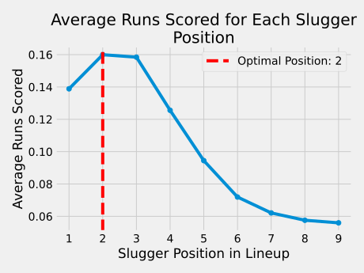

 # Finding the Perfect Batting Order for the New York Frets

A big thank you to [Zach Wissner-Gross](https://thefiddler.substack.com) for providing this fascinating puzzle. You can find the original puzzle [here](https://thefiddler.substack.com/p/can-you-set-a-winning-baseball-lineup).

Baseball is a game of strategy and skill, and managing a team requires attention to intricate details. Let's take a look at two unique puzzles and how we approached the solutions.

## Original Puzzle: Where to Place the Home Run Slugger?
You are the manager of the New York Frets, and it's been a tough season. You need to make a decision: Where should you place your home run slugger in the batting lineup? Eight of your batters are "pure contact" hitters, scoring a single one-third of the time. The ninth batter is your home run slugger, who hits a home run one-tenth of the time but strikes out the rest.

To solve this puzzle, we simulated the first inning using different positions for the slugger. By iterating through various batting orders and running simulations, we were able to determine the optimal position for the slugger to maximize the average number of runs scored.

## Extra Credit: Two Sluggers and Nine Innings
The season's not over yet! Now you've got two sluggers in your lineup, and you want to maximize the runs scored over nine innings. Where should you place your two sluggers to achieve this goal?

We extended our previous approach to account for two sluggers. By running simulations for all possible combinations of positions for the sluggers, we evaluated the average runs scored over nine innings.

And we didn't stop there. We created a visual representation using a heatmap, where the X and Y axes represent the positions of the two sluggers, and the color indicates the average runs scored. The heatmap provides an intuitive way to explore how different combinations of positions impact the game.

Here's what the heatmap looks like:

# Conclusion
Whether you're a manager looking to right the ship or a fan curious about baseball strategy, these puzzles reveal the intriguing complexity of the game. By using mathematical simulations and visually appealing plots, we can explore innovative strategies to improve performance and win games.

So grab your cap, head to the field, and remember, baseball is more than just swinging a bat; it's a game of numbers, strategy, and endless possibilities.

Now, who's ready for some peanuts and Cracker Jack? Play ball! 🧢⚾